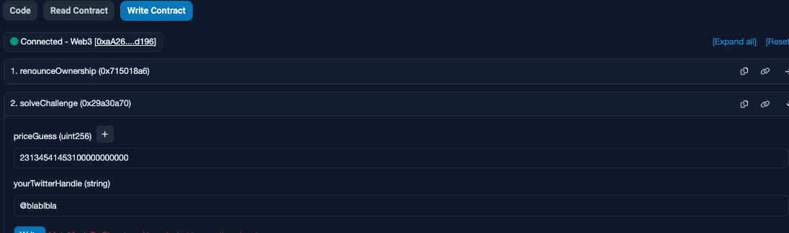

<!-- @format -->

# English README 　[Jump to Japanese Version](#japanese)

# On-chain contract challenges solutions

 

 

- This is Various challenge solutions for contracts that have already been deployed on the testnet and made by `Patrick Collins` / `Cyfrin`.
- It's a way to practice how to interact with and read other contracts. There are simple challenges as well as challenges that require interaction with external contracts or to exploit them.
- The problem description of each challenge is included in the smart-contract.
- Upon solving a challenge, the reward is an NFT.
- Problems are available on `Sepolia` and `Arbitrum`.

Here are the writeups of my solutions levels I cleared.
** I will not recommend you to look at solutions I wrote. Solve it yourself for your learning 😛 **

# How to interact with contracts

- You can use [Remix](https://remix.ethereum.org/) and Foundry to interact with the contracts.
- If your confortable with Foundry and Methods call using `cast` and `send` and contract interaction requiring an external contract, then you can also solve problem from Foundry only.
- If you are not confortable yet with ABI, then it is a great way to learn about it and how to call any contract by external calls.
- In higher difficulty challenges, you will need to wrote smart contracts and interfaces to hack some smart contract externally for clearing chellenges.

# Verify your result

- There is 2 way to verify if your solution was correct or not.

1. Verify the transaction you made on the blockchain explorer.
2. Easiest way is just to take a look at Opensea and see if you have the NFT: [Here](https://testnets.opensea.io/account)

 

 

# The list of all challenges

0.

- I don't have the arbitrum address for this one
- Sepolia https://sepolia.etherscan.io/address/0x55e959cc29f38224faebac65b8d8adfea021e65b#code

1.

- Arbitrum https://arbiscan.io/address/0x2e99A4CA9c85383ccB54769adB3837437e296479#code
- Sepolia https://sepolia.etherscan.io/address/0x25056312685339b49e1d1C5a0b72Ff9eff13AF77#code

2.

- Arbitrum https://arbiscan.io/address/0x76D2403b80591d5F6AF2b468BC14205fa5452AC0#code
- Sepolia https://sepolia.etherscan.io/address/0x5c1ddb86F11BB46D3067C702AC554aEaED9ff8f0#code

3.

- Arbitrum https://arbiscan.io/address/0x34d130B174F4a30A846FED7C02FCF53A19a4c2B6#code
- Sepolia https://sepolia.etherscan.io/address/0x4A62A8901e6113dEF0AEeEC77E531779cd40da73#code

4.

- Arbitrum https://arbiscan.io/address/0xA2626bE06C11211A44fb6cA324A67EBDBCd30B70#code
- Sepolia https://sepolia.etherscan.io/address/0x1b30DA2a868704483143A4D46865Ac9585629fd0#code

5.

- Arbitrum https://arbiscan.io/address/0xf988Ebf9D801F4D3595592490D7fF029E438deCa#code
- Sepolia https://sepolia.etherscan.io/address/0x4b3a7F293091708dDD6B8748179aeAF80E9c1bA2#code

6.

- Arbitrum https://arbiscan.io/address/0xdeB8d8eFeF7049E280Af1d5FE3a380F3BE93B648#code
- Sepolia https://sepolia.etherscan.io/address/0x6c4791c3a9E9Bc5449045872Bd1b602d6385E3E1#code

7.

- Arbitrum https://arbiscan.io/address/0xcf4fbA490197452Bd414E16D563623253eFb57D3#code
- Sepolia https://sepolia.etherscan.io/address/0xD7D127991c6A89Df752FC3daeC17540aE8B86101#code

8. ipfs://QmUgc1xpNgTMwSF2GBS5FTFKmSdrmSnLJD5DoYZtcQ2n5X

9.

- Arbitrum https://arbiscan.io/address/0xdF7cdFF0c5e85c974D6377244D9A0CEffA2b7A86#code
- Sepolia https://sepolia.etherscan.io/address/0x33e1fD270599188BB1489a169dF1f0be08b83509#code

10.

- Arbitrum https://arbiscan.io/address/0xaB67557218F60C06acA750B9F8A20018e5604ebf#code
- Sepolia https://sepolia.etherscan.io/address/0xE0aE410a16776BCcb04A8d4B0151Bb3F25035994#code

11.

- Arbitrum https://arbiscan.io/address/0x444aE92325dCE5D14d40c30d2657547513674dD6#code
- Sepolia https://sepolia.etherscan.io/address/0x93c7A945af9c453a8c932bf47683B5eB8C2F8792#code

12.

- Arbitrum https://arbiscan.io/address/0x3dbbf2f9acfb9aac8e0b31563dd75a2d69148d64#code
- Sepolia https://sepolia.etherscan.io/address/0xe5760847db2f10a74fc575b4803df5fe129811c1#code

13.

- Arbitrum https://arbiscan.io/address/0x3aD9F29AB266E4828450B33df7a9B9D7355Cd821#code
- Sepolia https://sepolia.etherscan.io/address/0xaFa4150818b7843345A5E54E430Bd0cAE31B5c0C#code

14.

- Arbitrum https://arbiscan.io/address/0xc584bD01fD60F671409661a6802170BbEFba5c47#code
- Sepolia https://sepolia.etherscan.io/address/0x46F3fE2C8aC9e9AE4DEDE1a7a29Ab3BdcFa7eaFc#code

15.

- Arbitrum https://arbiscan.io/address/0xa0c7ADA2c7c29729d12e2649BC6a0a293Ac46725#code
- Sepolia https://sepolia.etherscan.io/address/0x766a74f8924C7B07df088fDB0F7D7DbaDd330Fb3#code

## Challenge 0 and 1

Introductory level.  

- You just need to pass a 'Twitter handle' to the 'solveChallenge' function

### Contract

 

 

0.

- I don't have the arbitrum address for this one
- Sepolia https://sepolia.etherscan.io/address/0x55e959cc29f38224faebac65b8d8adfea021e65b#code

1.

- Arbitrum https://arbiscan.io/address/0x2e99A4CA9c85383ccB54769adB3837437e296479#code
- Sepolia https://sepolia.etherscan.io/address/0x25056312685339b49e1d1C5a0b72Ff9eff13AF77#code

### Solution

- `Twitter handle` = `@xxxxxxx`

 

 

### NFT challenge 0 and 1

 

 

## Challenge 2

- The number to send within the transaction, must be equal to the number set on the `someNumber` variable of the contract.
- Fill in your Twitter handle.

### Contract

 

 

2.

- Arbitrum https://arbiscan.io/address/0x76D2403b80591d5F6AF2b468BC14205fa5452AC0#code
- Sepolia https://sepolia.etherscan.io/address/0x5c1ddb86F11BB46D3067C702AC554aEaED9ff8f0#code

### Solution

- `number` = `123`
- `Twitter handle` = `@xxxxxxx`

 

 

### NFT challenge 2

 

 

## Challenge 3

- Booleans. You need to pass the right boolean to the function, as a number. the `solveChallenge` function will revert if the boolean of `location` is not `true`.
- `0` = `false` and `1` = `true`
- Fill in your Twitter handle.

### Contract

 

 

3.

- Arbitrum https://arbiscan.io/address/0x34d130B174F4a30A846FED7C02FCF53A19a4c2B6#code
- Sepolia https://sepolia.etherscan.io/address/0x4A62A8901e6113dEF0AEeEC77E531779cd40da73#code

### Solution

- `location` = `1`
- `newLocation` = `0` or `1`
- `Twitter handle` = `@xxxxxxx`

 

 

### NFT challenge 3

 

 

## Challenge 4

- Using Chainlink `priceFeed`, you need to get the `actual` price of `Eth` and pass it as the `priceGuess` parameter of the `solveChallenge` function. Your priceFeed value will then be compared and checked to see if it is equal to the actual price.
- The value needs to have `18 decimals`. Example: `23014670313300000000000`
- Fill in your Twitter handle.

### Contract

 

 

4.

- Arbitrum https://arbiscan.io/address/0xA2626bE06C11211A44fb6cA324A67EBDBCd30B70#code
- Sepolia https://sepolia.etherscan.io/address/0x1b30DA2a868704483143A4D46865Ac9585629fd0#code

### Solution

- How to solve it:

1. We can have a simple contract checking the price and then calling the `solveChallenge` function with the right price, in one transaction. And then having a function for sending the NFT from the contract we used to our wallet. 
   OR
    
2. We can check the price and separately call the `solveChallenge` function with the right price, using the `cast` method of Foundry.
3. Same as the point 2, but by interacting directly on Etherscan.

- Parameters:
- `priceGuess` = `ActualEthPrice`
- `Twitter handle` = `@xxxxxxx`

 

 

#### Using the `manual` method

- Because I share the solution, now hope you will be fast enough to input the price in time. 😛 So I don't give the `cast` command or an extra way in the contract to do all in one row.

1. Deploy the contract from this folder [./challenge_4/priceFeedChecker.sol](https://github.com/Jer-B/Foundry_onchain_challenges_-spoil-/blob/main/challenge_4/priceFeedChecker.sol) on [Remix](https://remix.ethereum.org/) using `Injected Provider - Metamask` as `Environment`. See the screenshot below.

2. Once it is deployed, use the getter function `getPriceEth` to get the actual price of Eth.

3. Copy the result and paste it in the `priceGuess` parameter of the `solveChallenge` function in the command below.

 

 

 

 

### NFT challenge 4

 

 

 
 
 

# 日本語版の README

# オンチェーン問題チャレンジの解決策

 

 

- テストネット上に既にデプロイされており、`Patrick Collins` / `Cyfrin` によって作成された様々なコントラクトのチャレンジソリューションです。
- これは、他のコントラクトとどのようにやり取りし、読み取るかを実践する方法です。シンプルなチャレンジから、外部コントラクトとのやり取りやそれらを利用する必要があるチャレンジまであります。
- 各チャレンジの問題の説明はスマートコントラクトに含まれています。
- チャレンジを解決すると、報酬として NFT がもらえます。
- 問題は `Sepolia` と `Arbitrum` で利用可能です。

これはクリアしたレベルの解決策です。
**解決策を見ることをお勧めしません。学習のために自分で解決してください 😛 **

# コントラクトとのやり取り方法

- コントラクトとやり取りするには、[Remix](https://remix.ethereum.org/)と Foundry を使用できます。
- Foundry と`cast`や`send`を使ったメソッド呼び出し、外部コントラクトが必要なコントラクトのやり取りに慣れている場合は、Foundry だけで問題を解決することもできます。
- まだ ABI に慣れていない場合、それを使用して任意のコントラクトを外部呼び出しで呼び出す方法について学び、理解するのに最適な方法です。
- より高難度のチャレンジでは、スマートコントラクトとインターフェースを作成して、いくつかのスマートコントラクトを外部からハッキングするために解チャレンジをクリアする必要があります。

# 結果を確認する

- 解決策が正しかったかどうかを確認する方法は 2 つあります。

1. ブロックチェーンエクスプローラーで行ったトランザクションを確認します。
2. もっとも簡単な方法は、Opensea で NFT を持っているかどうかを確認することです： [こちら](https://testnets.opensea.io/account)

 

 

# 全てのチャレンジ一覧

0.

- Arbitrum のアドレスは知りません。
- Sepolia https://sepolia.etherscan.io/address/0x55e959cc29f38224faebac65b8d8adfea021e65b#code

1.

- Arbitrum https://arbiscan.io/address/0x2e99A4CA9c85383ccB54769adB3837437e296479#code
- Sepolia https://sepolia.etherscan.io/address/0x25056312685339b49e1d1C5a0b72Ff9eff13AF77#code

2.

- Arbitrum https://arbiscan.io/address/0x76D2403b80591d5F6AF2b468BC14205fa5452AC0#code
- Sepolia https://sepolia.etherscan.io/address/0x5c1ddb86F11BB46D3067C702AC554aEaED9ff8f0#code

3.

- Arbitrum https://arbiscan.io/address/0x34d130B174F4a30A846FED7C02FCF53A19a4c2B6#code
- Sepolia https://sepolia.etherscan.io/address/0x4A62A8901e6113dEF0AEeEC77E531779cd40da73#code

4.

- Arbitrum https://arbiscan.io/address/0xA2626bE06C11211A44fb6cA324A67EBDBCd30B70#code
- Sepolia https://sepolia.etherscan.io/address/0x1b30DA2a868704483143A4D46865Ac9585629fd0#code

5.

- Arbitrum https://arbiscan.io/address/0xf988Ebf9D801F4D3595592490D7fF029E438deCa#code
- Sepolia https://sepolia.etherscan.io/address/0x4b3a7F293091708dDD6B8748179aeAF80E9c1bA2#code

6.

- Arbitrum https://arbiscan.io/address/0xdeB8d8eFeF7049E280Af1d5FE3a380F3BE93B648#code
- Sepolia https://sepolia.etherscan.io/address/0x6c4791c3a9E9Bc5449045872Bd1b602d6385E3E1#code

7.

- Arbitrum https://arbiscan.io/address/0xcf4fbA490197452Bd414E16D563623253eFb57D3#code
- Sepolia https://sepolia.etherscan.io/address/0xD7D127991c6A89Df752FC3daeC17540aE8B86101#code

8. ipfs://QmUgc1xpNgTMwSF2GBS5FTFKmSdrmSnLJD5DoYZtcQ2n5X

9.

- Arbitrum https://arbiscan.io/address/0xdF7cdFF0c5e85c974D6377244D9A0CEffA2b7A86#code
- Sepolia https://sepolia.etherscan.io/address/0x33e1fD270599188BB1489a169dF1f0be08b83509#code

10.

- Arbitrum https://arbiscan.io/address/0xaB67557218F60C06acA750B9F8A20018e5604ebf#code
- Sepolia https://sepolia.etherscan.io/address/0xE0aE410a16776BCcb04A8d4B0151Bb3F25035994#code

11.

- Arbitrum https://arbiscan.io/address/0x444aE92325dCE5D14d40c30d2657547513674dD6#code
- Sepolia https://sepolia.etherscan.io/address/0x93c7A945af9c453a8c932bf47683B5eB8C2F8792#code

12.

- Arbitrum https://arbiscan.io/address/0x3dbbf2f9acfb9aac8e0b31563dd75a2d69148d64#code
- Sepolia https://sepolia.etherscan.io/address/0xe5760847db2f10a74fc575b4803df5fe129811c1#code

13.

- Arbitrum https://arbiscan.io/address/0x3aD9F29AB266E4828450B33df7a9B9D7355Cd821#code
- Sepolia https://sepolia.etherscan.io/address/0xaFa4150818b7843345A5E54E430Bd0cAE31B5c0C#code

14.

- Arbitrum https://arbiscan.io/address/0xc584bD01fD60F671409661a6802170BbEFba5c47#code
- Sepolia https://sepolia.etherscan.io/address/0x46F3fE2C8aC9e9AE4DEDE1a7a29Ab3BdcFa7eaFc#code

15.

- Arbitrum https://arbiscan.io/address/0xa0c7ADA2c7c29729d12e2649BC6a0a293Ac46725#code
- Sepolia https://sepolia.etherscan.io/address/0x766a74f8924C7B07df088fDB0F7D7DbaDd330Fb3#code

## チャレンジ 0 と 1.

入門レベル。  

- 'Twitter handle' を 'solveChallenge' 関数に渡すだけです。

### コントラクト

 

 

0.

- Arbitrum のアドレスは知りません。
- Sepolia https://sepolia.etherscan.io/address/0x55e959cc29f38224faebac65b8d8adfea021e65b#code

1.

- Arbitrum https://arbiscan.io/address/0x2e99A4CA9c85383ccB54769adB3837437e296479#code
- Sepolia https://sepolia.etherscan.io/address/0x25056312685339b49e1d1C5a0b72Ff9eff13AF77#code

### 解決策

- `Twitter handle` = `@xxxxxxx`

 

 

### NFT チャレンジ 0 と 1

 

 

## チャレンジ 2

- トランザクション内で送信する数値は、コントラクトの someNumber 変数に設定された数値と等しくなければなりません。
- Twitter ハンドルを入力する。

### コントラクト

 

 

2.

- Arbitrum https://arbiscan.io/address/0x76D2403b80591d5F6AF2b468BC14205fa5452AC0#code
- Sepolia https://sepolia.etherscan.io/address/0x5c1ddb86F11BB46D3067C702AC554aEaED9ff8f0#code

### 解決策

- `number` = `123`
- `Twitter handle` = `@xxxxxxx`

 

 

### NFT チャレンジ 2

 

 

 
 
 

## チャレンジ 3

- ブール値。関数に正しいブール値を数値として渡す必要があります。`location`のブール値が true でない場合、`solveChallenge`関数はリバートされます。
- `0` = `false`、`1` = `true`
- Twitter ハンドルを入力する。

### コントラクト

 

 

3.

- Arbitrum https://arbiscan.io/address/0x34d130B174F4a30A846FED7C02FCF53A19a4c2B6#code
- Sepolia https://sepolia.etherscan.io/address/0x4A62A8901e6113dEF0AEeEC77E531779cd40da73#code

### 解決策

- `location` = `1`
- `newLocation` = `0` or `1`
- `Twitter handle` = `@xxxxxxx`

 

 

### NFT チャレンジ 3

 

 

## チャレンジ 4

- Chainlink の `priceFeed`を使用して、 `Eth`の`実際`の価格を取得し、その価格を`solveChallenge`関数の`priceGuess` パラメータとして渡す必要があります。
  priceFeed 値は比較され、実際の価格と等しいかどうかがチェックされます。
- 価格は `18桁の小数`を持つ必要があります。例:`23014670313300000000000`
- Twitter ハンドルを入力する。

### コントラクト

 

 

4.

- Arbitrum https://arbiscan.io/address/0xA2626bE06C11211A44fb6cA324A67EBDBCd30B70#code
- Sepolia https://sepolia.etherscan.io/address/0x1b30DA2a868704483143A4D46865Ac9585629fd0#code

### 解決策

- 解決方法:

1. 価格をチェックし、正しい価格で`solveChallenge`関数を呼び出すシンプルなコントラクトを用意し、一つのトランザクションでこれを行うことができます。そして、使用したコントラクトからウォレットに NFT を送信する方法を使う。 
   OR
    
2. 価格をチェックし、Foundry の`cast`メソッドを使用して、別途正しい価格で`solveChallenge`関数を呼び出すことができます。
3. Etherscan 上で直接操作することもできます。

- パラメーター:
- `priceGuess` = `Ethの実際の価格`
- `Twitter handle` = `@xxxxxxx`

### `マニュアル`方法を使用する (3 番)

- 解決策を共有するので、価格をタイムリーに入力できることを願っています。😛 ですので、一行で全てを行うための`cast`コマンドや契約内の追加方法は提供しません。

1. このフォルダー[./challenge_4/priceFeedChecker.sol](https://github.com/Jer-B/Foundry_onchain_challenges_-spoil-/blob/main/challenge_4/priceFeedChecker.sol)からコントラクトを[Remix](https://remix.ethereum.org/)で`Injected Provider - Metamask`を`Environment`として使用してデプロイします。以下のスクリーンショットを参照してください。
2. デプロイされたら、ゲッター関数`getPriceEth`を使用して Eth の実際の価格を取得します。
3. 結果をコピーして、以下のコマンドの`solveChallenge`関数の`priceGuess`パラメータに貼り付けます。

 

 

 

 

### NFT チャレンジ 4

 

 
